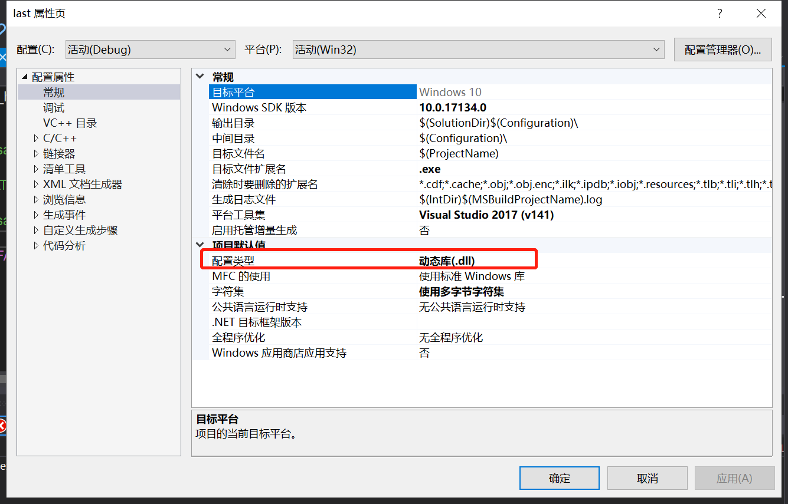
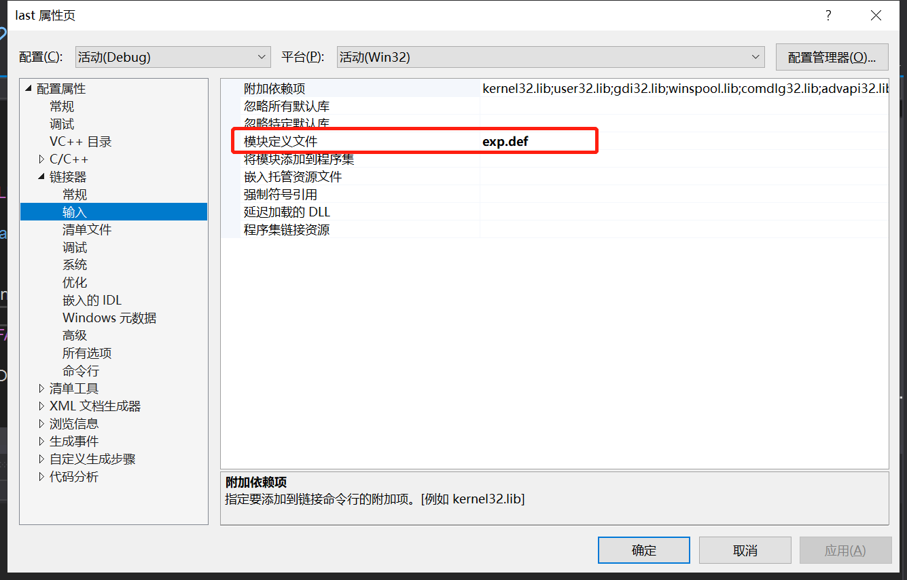
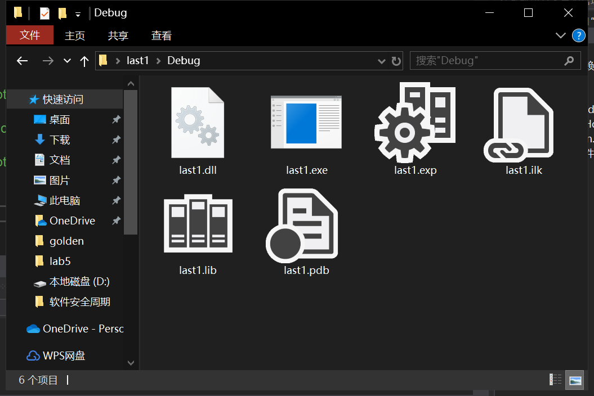

# 大作业

## 作业要求（多选一）

- hook writefile，使得每次写文件时，如果每次写的文件的“哈哈哈”，改为“呵呵呵”，并验证hook是否正确 (√)
- 把这个文件写为dll，通过下午的示例代码注入到notepad类似进程中，进行hook，hook完之后实验hook是否成功，写一个“哈哈哈”进入txt中，再打开后变为了“呵呵呵”，同理可以去改`findfirstfile`进行dir时，只要出现“hack.exe”就把这个结果抹掉
- 实现系统进程`tasklist`遍历不到`hack.exe`这个进程
- 利用`setwindowtext`不改输出，但是记录计算器的输出，实现屏幕取词
- 接管其他进程，接管键盘的输入，注入到微信进程文本框输入
- 通过`线程注入技术`和`IAThook`技术的综合使用(进行记事本和dir,计算器)

## 完成过程

1. 参考Lab5，修改main.c与IATHook.c

main.c

```c++
#include <windows.h>


LONG IATHook(
	__in_opt void* pImageBase,
	__in_opt char* pszImportDllName,
	__in char* pszRoutineName,
	__in void* pFakeRoutine,
	__out HANDLE* phHook
);

LONG UnIATHook(__in HANDLE hHook);

void* GetIATHookOrign(__in HANDLE hHook);

//typedef int(__stdcall* LPFN_MessageBoxA)(__in_opt HWND hWnd, __in_opt char* lpText, __in_opt char* lpCaption, __in UINT uType);
typedef int(__stdcall* LPFN_WriteFile)(__in_opt HANDLE hFile, __in_opt LPCVOID      lpBuffer, __in_opt DWORD        nNumberOfBytesToWrite, __in LPDWORD      lpNumberOfBytesWritten, __in LPOVERLAPPED lpOverlapped);
HANDLE g_hHook_WriteFile = NULL;
//HANDLE g_hHook_MessageBoxA = NULL;
//////////////////////////////////////////////////////////////////////////
int __stdcall Fake_WriteFile(
	HANDLE       hFile,
	LPCVOID      lpBuffer,
	DWORD        nNumberOfBytesToWrite,
	LPDWORD      lpNumberOfBytesWritten,
	LPOVERLAPPED lpOverlapped
) {
	LPFN_WriteFile fnOrigin = (LPFN_WriteFile)GetIATHookOrign(g_hHook_WriteFile);

	char DataBuffer[] = "呵呵呵";//将输出内容改为“呵呵呵”
	DWORD dwBytesToWrite = (DWORD)strlen(DataBuffer);
	DWORD dwBytesWritten = 0;

	return fnOrigin(hFile, DataBuffer, dwBytesToWrite, &dwBytesWritten, lpOverlapped);
}
//int __stdcall Fake_MessageBoxA(__in_opt HWND hWnd, __in_opt char* lpText, __in_opt char* lpCaption, __in UINT uType)
//{
//	LPFN_MessageBoxA fnOrigin = (LPFN_MessageBoxA)GetIATHookOrign(g_hHook_MessageBoxA);
//
//	return fnOrigin(hWnd, "hook", lpCaption, uType);
//}

int __cdecl wmain(int nArgc, WCHAR** Argv)
{
	do
	{
		UNREFERENCED_PARAMETER(nArgc);
		UNREFERENCED_PARAMETER(Argv);

		IATHook(
			GetModuleHandle(NULL),
			"kernel32.dll",
			"WriteFile",
			Fake_WriteFile,
			&g_hHook_WriteFile
		);

		//MessageBoxA(NULL, "test", "caption", 0);

		//UnIATHook(g_hHook_MessageBoxA);

		//MessageBoxA(NULL, "test", "caption", 0);

	} while (FALSE);

	return 0;
}
```

IATHook.c

```c++
// windows IATHook for kernelmode and usermode 
// by TinySec( root@tinysec.net )
// you can free use this code , but if you had modify , send a copy to to my email please.


/*
LONG IATHook
(
__in void* pImageBase ,
__in_opt char* pszImportDllName ,
__in char* pszRoutineName ,
__in void* pFakeRoutine ,
__out HANDLE* Param_phHook
);

LONG UnIATHook( __in HANDLE hHook );

void* GetIATHookOrign( __in HANDLE hHook );
*/


//////////////////////////////////////////////////////////////////////////

#ifdef _RING0
#include <ntddk.h>
#include <ntimage.h>
#else
#include <windows.h>
#include <stdlib.h>
#endif //#ifdef _RING0


//////////////////////////////////////////////////////////////////////////

typedef struct _IATHOOK_BLOCK
{
	void*	pOrigin;

	void*	pImageBase;
	char*	pszImportDllName;
	char*	pszRoutineName;

	void*	pFake;

}IATHOOK_BLOCK;


//////////////////////////////////////////////////////////////////////////

void* _IATHook_Alloc(__in ULONG nNeedSize)
{
	void* pMemory = NULL;

	do
	{
		if (0 == nNeedSize)
		{
			break;
		}

#ifdef _RING0
		pMemory = ExAllocatePoolWithTag(NonPagedPool, nNeedSize, 'iath');

#else
		pMemory = malloc(nNeedSize);
#endif // #ifdef _RING0

		if (NULL == pMemory)
		{
			break;
		}

		RtlZeroMemory(pMemory, nNeedSize);

	} while (FALSE);

	return pMemory;
}


ULONG _IATHook_Free(__in void* pMemory)
{

	do
	{
		if (NULL == pMemory)
		{
			break;
		}

#ifdef _RING0
		ExFreePool(pMemory);

#else
		free(pMemory);
#endif // #ifdef _RING0

		pMemory = NULL;

	} while (FALSE);

	return 0;
}

//////////////////////////////////////////////////////////////////////////
#ifdef _RING0


#ifndef LOWORD
#define LOWORD(l)           ((USHORT)((ULONG_PTR)(l) & 0xffff))
#endif // #ifndef LOWORD


void*  _IATHook_InterlockedExchangePointer(__in void* pAddress, __in void* pValue)
{
	void*	pWriteableAddr = NULL;
	PMDL	pNewMDL = NULL;
	void*	pOld = NULL;

	do
	{
		if ((NULL == pAddress))
		{
			break;
		}

		if (!NT_SUCCESS(MmIsAddressValid(pAddress)))
		{
			break;
		}

		pNewMDL = IoAllocateMdl(pAddress, sizeof(void*), FALSE, FALSE, NULL);
		if (pNewMDL == NULL)
		{
			break;
		}

		__try
		{
			MmProbeAndLockPages(pNewMDL, KernelMode, IoWriteAccess);

			pNewMDL->MdlFlags |= MDL_MAPPING_CAN_FAIL;

			pWriteableAddr = MmMapLockedPagesSpecifyCache(
				pNewMDL,
				KernelMode,
				MmNonCached,
				NULL,
				FALSE,
				HighPagePriority
			);

			//pWriteableAddr = MmMapLockedPages(pNewMDL, KernelMode);
		}
		__except (EXCEPTION_EXECUTE_HANDLER)
		{
			break;
		}

		if (pWriteableAddr == NULL)
		{
			MmUnlockPages(pNewMDL);
			IoFreeMdl(pNewMDL);

			break;
		}

		pOld = InterlockedExchangePointer(pWriteableAddr, pValue);

		MmUnmapLockedPages(pWriteableAddr, pNewMDL);
		MmUnlockPages(pNewMDL);
		IoFreeMdl(pNewMDL);

	} while (FALSE);

	return pOld;
}


//////////////////////////////////////////////////////////////////////////
#else

void*  _IATHook_InterlockedExchangePointer(__in void* pAddress, __in void* pValue)
{
	void*	pWriteableAddr = NULL;
	void*	nOldValue = NULL;
	ULONG	nOldProtect = 0;
	BOOL	bFlag = FALSE;

	do
	{
		if ((NULL == pAddress))
		{
			break;
		}

		bFlag = VirtualProtect(pAddress, sizeof(void*), PAGE_EXECUTE_READWRITE, &nOldProtect);
		if (!bFlag)
		{
			break;
		}
		pWriteableAddr = pAddress;

		nOldValue = InterlockedExchangePointer(pWriteableAddr, pValue);

		VirtualProtect(pAddress, sizeof(void*), nOldProtect, &nOldProtect);

	} while (FALSE);

	return nOldValue;
}

#endif // #ifdef _RING0


LONG _IATHook_Single
(
	__in IATHOOK_BLOCK*	pHookBlock,
	__in IMAGE_IMPORT_DESCRIPTOR*	pImportDescriptor,
	__in BOOLEAN bHook
)
{
	LONG				nFinalRet = -1;

	IMAGE_THUNK_DATA*	pOriginThunk = NULL;
	IMAGE_THUNK_DATA*	pRealThunk = NULL;

	IMAGE_IMPORT_BY_NAME*	pImportByName = NULL;

	do
	{
		pOriginThunk = (IMAGE_THUNK_DATA*)((UCHAR*)pHookBlock->pImageBase + pImportDescriptor->OriginalFirstThunk);
		pRealThunk = (IMAGE_THUNK_DATA*)((UCHAR*)pHookBlock->pImageBase + pImportDescriptor->FirstThunk);

		for (; 0 != pOriginThunk->u1.Function; pOriginThunk++, pRealThunk++)
		{
			if (IMAGE_ORDINAL_FLAG == (pOriginThunk->u1.Ordinal & IMAGE_ORDINAL_FLAG))
			{
				if ((USHORT)pHookBlock->pszRoutineName == LOWORD(pOriginThunk->u1.Ordinal))
				{
					if (bHook)
					{
						pHookBlock->pOrigin = (void*)pRealThunk->u1.Function;
						_IATHook_InterlockedExchangePointer((void**)&pRealThunk->u1.Function, pHookBlock->pFake);
					}
					else
					{
						_IATHook_InterlockedExchangePointer((void**)&pRealThunk->u1.Function, pHookBlock->pOrigin);
					}

					nFinalRet = 0;
					break;
				}
			}
			else
			{
				pImportByName = (IMAGE_IMPORT_BY_NAME*)((char*)pHookBlock->pImageBase + pOriginThunk->u1.AddressOfData);

				if (0 == _stricmp(pImportByName->Name, pHookBlock->pszRoutineName))
				{
					if (bHook)
					{
						pHookBlock->pOrigin = (void*)pRealThunk->u1.Function;
						_IATHook_InterlockedExchangePointer((void**)&pRealThunk->u1.Function, pHookBlock->pFake);
					}
					else
					{
						_IATHook_InterlockedExchangePointer((void**)&pRealThunk->u1.Function, pHookBlock->pOrigin);
					}

					nFinalRet = 0;

					break;
				}
			}

		}

	} while (FALSE);

	return nFinalRet;
}


LONG _IATHook_Internal(__in IATHOOK_BLOCK* pHookBlock, __in BOOLEAN bHook)
{
	LONG				nFinalRet = -1;
	LONG				nRet = -1;
	IMAGE_DOS_HEADER*	pDosHeader = NULL;
	IMAGE_NT_HEADERS*	pNTHeaders = NULL;

	IMAGE_IMPORT_DESCRIPTOR*	pImportDescriptor = NULL;
	char*						pszImportDllName = NULL;


	do
	{
		if (NULL == pHookBlock)
		{
			break;
		}

		pDosHeader = (IMAGE_DOS_HEADER*)pHookBlock->pImageBase;
		if (IMAGE_DOS_SIGNATURE != pDosHeader->e_magic)
		{
			break;
		}

		pNTHeaders = (IMAGE_NT_HEADERS*)((UCHAR*)pHookBlock->pImageBase + pDosHeader->e_lfanew);
		if (IMAGE_NT_SIGNATURE != pNTHeaders->Signature)
		{
			break;
		}

		if (0 == pNTHeaders->OptionalHeader.DataDirectory[IMAGE_DIRECTORY_ENTRY_IMPORT].VirtualAddress)
		{
			break;
		}

		if (0 == pNTHeaders->OptionalHeader.DataDirectory[IMAGE_DIRECTORY_ENTRY_IMPORT].Size)
		{
			break;
		}

		pImportDescriptor = (IMAGE_IMPORT_DESCRIPTOR*)((UCHAR*)pHookBlock->pImageBase + pNTHeaders->OptionalHeader.DataDirectory[IMAGE_DIRECTORY_ENTRY_IMPORT].VirtualAddress);


		// Find pszRoutineName in every Import descriptor
		nFinalRet = -1;

		for (; (pImportDescriptor->Name != 0); pImportDescriptor++)
		{
			pszImportDllName = (char*)pHookBlock->pImageBase + pImportDescriptor->Name;

			if (NULL != pHookBlock->pszImportDllName)
			{
				if (0 != _stricmp(pszImportDllName, pHookBlock->pszImportDllName))
				{
					continue;
				}
			}

			nRet = _IATHook_Single(
				pHookBlock,
				pImportDescriptor,
				bHook
			);

			if (0 == nRet)
			{
				nFinalRet = 0;
				break;
			}
		}

	} while (FALSE);

	return nFinalRet;
}

LONG IATHook
(
	__in void* pImageBase,
	__in_opt char* pszImportDllName,
	__in char* pszRoutineName,
	__in void* pFakeRoutine,
	__out HANDLE* Param_phHook
)
{
	LONG				nFinalRet = -1;
	IATHOOK_BLOCK*		pHookBlock = NULL;


	do
	{
		if ((NULL == pImageBase) || (NULL == pszRoutineName) || (NULL == pFakeRoutine))
		{
			break;
		}

		pHookBlock = (IATHOOK_BLOCK*)_IATHook_Alloc(sizeof(IATHOOK_BLOCK));
		if (NULL == pHookBlock)
		{
			break;
		}
		RtlZeroMemory(pHookBlock, sizeof(IATHOOK_BLOCK));

		pHookBlock->pImageBase = pImageBase;
		pHookBlock->pszImportDllName = pszImportDllName;
		pHookBlock->pszRoutineName = pszRoutineName;
		pHookBlock->pFake = pFakeRoutine;

		__try
		{
			nFinalRet = _IATHook_Internal(pHookBlock, TRUE);
		}
		__except (EXCEPTION_EXECUTE_HANDLER)
		{
			nFinalRet = -1;
		}

	} while (FALSE);

	if (0 != nFinalRet)
	{
		if (NULL != pHookBlock)
		{
			_IATHook_Free(pHookBlock);
			pHookBlock = NULL;
		}
	}

	if (NULL != Param_phHook)
	{
		*Param_phHook = pHookBlock;
	}

	return nFinalRet;
}

LONG UnIATHook(__in HANDLE hHook)
{
	IATHOOK_BLOCK*		pHookBlock = (IATHOOK_BLOCK*)hHook;
	LONG				nFinalRet = -1;

	do
	{
		if (NULL == pHookBlock)
		{
			break;
		}

		__try
		{
			nFinalRet = _IATHook_Internal(pHookBlock, FALSE);
		}
		__except (EXCEPTION_EXECUTE_HANDLER)
		{
			nFinalRet = -1;
		}

	} while (FALSE);

	if (NULL != pHookBlock)
	{
		_IATHook_Free(pHookBlock);
		pHookBlock = NULL;
	}

	return nFinalRet;
}

void* GetIATHookOrign(__in HANDLE hHook)
{
	IATHOOK_BLOCK*		pHookBlock = (IATHOOK_BLOCK*)hHook;
	void*				pOrigin = NULL;

	do
	{
		if (NULL == pHookBlock)
		{
			break;
		}

		pOrigin = pHookBlock->pOrigin;

	} while (FALSE);

	return pOrigin;
}

```

2. 修改vs属性





3. 生成dll项目（此处前一个last项目被玩坏了，于是重开last1项目，内容保持不变）



4. 新建项目，新建note.c，将dll注入到进程遍历的代码中，并且将生成的dll文件放到该项目的目录之下

```c++
#include <windows.h>
#include <stdio.h>
#include <tlhelp32.h>
#include <tchar.h>
#include <strsafe.h>

int main() {
	char szDllName[] = "note_IAT.dll";
	char szExeName[] = "notepad.exe";


	PROCESSENTRY32 ProcessEntry = {1};
	ProcessEntry.dwSize = sizeof(PROCESSENTRY32);
	HANDLE hProcessSnap = CreateToolhelp32Snapshot(TH32CS_SNAPPROCESS, 0);
	int bRet = Process32First(hProcessSnap, &ProcessEntry);
	DWORD dwProcessId = 0;
	while (bRet) {
		if (strcmp(szExeName, ProcessEntry.szExeFile) == 0) {
			dwProcessId = ProcessEntry.th32ProcessID;
			break;
		}
		bRet = Process32Next(hProcessSnap, &ProcessEntry);
	}
	if (0 == dwProcessId) {
		printf("找不到进程\n");
		return 1;
	}

	HANDLE hProcess = OpenProcess(PROCESS_ALL_ACCESS, FALSE, dwProcessId);
	if (0 == hProcess) {
		printf("无法打开进程\n");
		return 1;
	}

	
	size_t length = strlen(szDllName) + 1;
	char* pszDllFile = (char*)VirtualAllocEx(hProcess, NULL, length, MEM_COMMIT, PAGE_READWRITE);
	if (0 == pszDllFile) {
		printf("远程空间分配失败\n");
		return 1;
	}

	
	if (!WriteProcessMemory(hProcess, (PVOID)pszDllFile, (PVOID)szDllName, length, NULL)) {
		printf("远程空间写入失败\n");
		return 1;
	}

	
	PTHREAD_START_ROUTINE pfnThreadRtn = (PTHREAD_START_ROUTINE)GetProcAddress(GetModuleHandle("kernel32"), "LoadLibraryA");
	if (0 == pfnThreadRtn) {
		printf("LoadLibraryA函数地址获取失败\n");
		return 1;
	}


	HANDLE hThread = CreateRemoteThread(hProcess, NULL, 0, pfnThreadRtn, (PVOID)pszDllFile, 0, NULL);
	if (0 == hThread) {
		printf("远程线程创建失败\n");
		return 1;
	}

	
	WaitForSingleObject(hThread, INFINITE);
	printf("远程线程执行成功!\n");

	VirtualFreeEx(hProcess, (PVOID)pszDllFile, 0, MEM_RELEASE);
	CloseHandle(hThread);
	CloseHandle(hProcess);

	return 0;
}
```

进程遍历，找到notepad.exe时对它进行远程注入

4. 启动记事本，输入“哈哈哈”，保存。执行note.exe


5. 重新打开txt文件，会发现变成了 “呵呵呵”